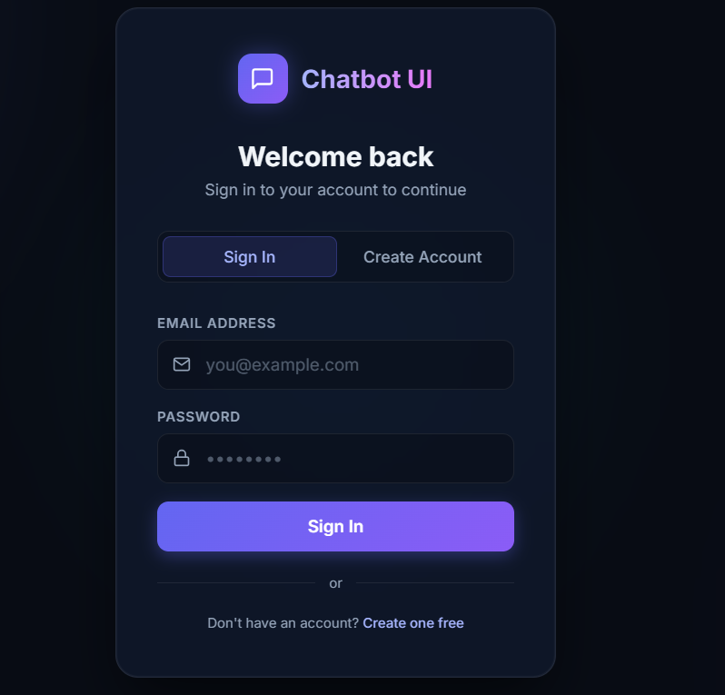
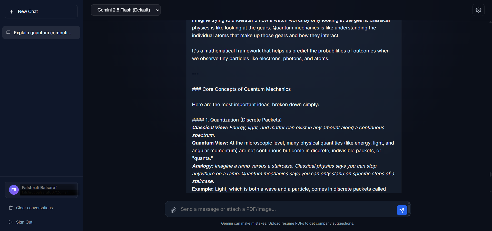

# 💬 Chatbot UI

A **premium, full-featured AI chatbot** powered by Google Gemini, built with Node.js + Express. Features a stunning dark-mode UI with file upload support, image generation, and email-based authentication.


---

## 📸 Screenshots

### 🔐 Login Page


### 💬 Chat Interface


---

## ✨ Features

- **🤖 Gemini AI Chat** — Powered by Google Gemini 2.5 Flash with automatic model fallback
- **🔐 Email Authentication** — Signup/login with secure bcrypt password hashing and session management
- **📄 PDF Analysis** — Upload resume PDFs and get AI-powered company suggestions tailored to your skills
- **🖼️ Image Understanding** — Upload images and have Gemini Vision describe or analyze them
- **🎨 AI Image Generation** — Generate images on demand via Pollinations AI (use `/image your prompt`)
- **💬 Multiple Conversations** — Manage multiple chat sessions with persistent local storage
- **⚙️ Model Selector** — Switch between Gemini models (2.5 Flash, 2.5 Pro, 1.5 Flash, etc.)
- **📝 Custom System Prompts** — Configure the AI's personality per conversation
- **🌙 Premium Dark UI** — Glassmorphism design with smooth animations

---

## 🚀 Getting Started

### Prerequisites
- Node.js 18+ installed
- A [Google Gemini API key](https://aistudio.google.com/app/apikey)

### Installation

```bash
# Clone the repository
git clone https://github.com/Falshruti/Chatbot.git
cd Chatbot

# Install dependencies
npm install

# Create your environment file
cp .env.example .env
# Then edit .env and add your GEMINI_API_KEY
```

### Configuration

Create a `.env` file in the project root:

```env
GEMINI_API_KEY=your_gemini_api_key_here
PORT=3001
SESSION_SECRET=your_random_secret_here
```

### Run the App

```bash
node server.js
```

Then open **[http://localhost:3001](https://chatbot-alpha-olive-40.vercel.app/)** in your browser.

---

## 📁 Project Structure

```
company-chatbot/
├── server.js          # Express backend (auth, chat, file upload routes)
├── index.html         # Main chat UI (dark-mode, glassmorphism)
├── login.html         # Login/Signup page
├── package.json       # Node.js dependencies
├── .env               # Environment variables (not committed)
├── screenshots/       # Project UI screenshots
├── .gitignore
└── README.md
```

---

## 🔒 Security Notes

- Passwords are hashed with `bcryptjs` (12 salt rounds)
- Sessions managed server-side with `express-session`
- `.env` and `users.json` are excluded from version control
- Create a `users.json` file (`[]`) on first run — it stores registered users locally

---

## 📦 Dependencies

| Package | Purpose |
|---------|---------|
| `express` | Web server framework |
| `@google/generative-ai` | Gemini AI SDK |
| `bcryptjs` | Password hashing |
| `express-session` | Session management |
| `multer` | File upload handling |
| `pdf-parse` | PDF text extraction (v2.4.5) |
| `dotenv` | Environment variable loading |
| `cors` | Cross-origin resource sharing |

---

## 💡 Usage Tips

- **Chat**: Type any message and press Enter or click Send
- **Image generation**: Type `/image a sunset over the ocean` to generate images
- **PDF analysis**: Click the 📎 attach button → select a PDF resume → press Send
- **Image analysis**: Attach any image file to have Gemini describe it
- **Custom AI**: Use the ⚙️ settings panel to set custom system instructions per chat

---

## 📜 License

MIT © Falshruti
